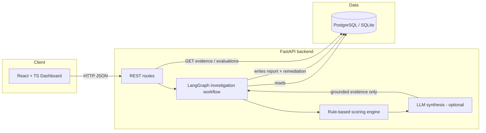
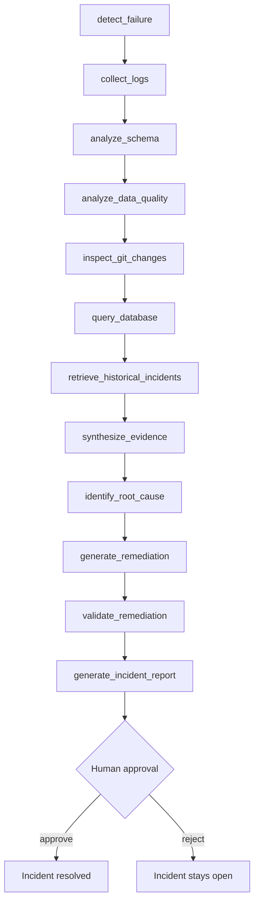
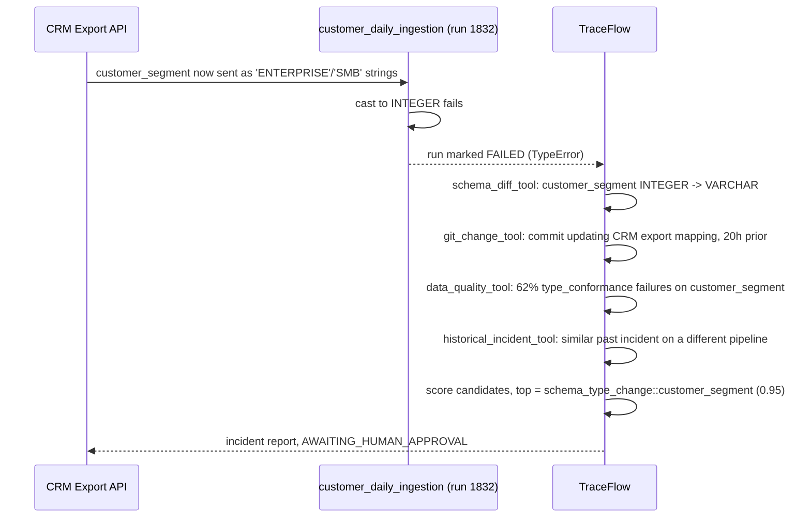
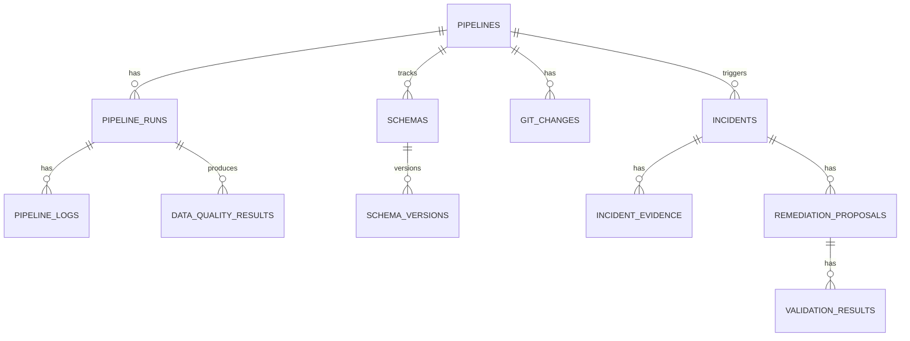

# Architecture

## System overview

TraceFlow AI investigates failed data pipeline runs. Given a triggering
`PipelineRun` in `failed` status, it collects structured evidence from
several deterministic sources, scores candidate root causes with a
transparent rule-based engine, uses an LLM only to turn that evidence into
readable prose, and produces an incident report that requires human
approval before any remediation is considered "done."

## Investigation workflow (LangGraph state machine)

This is a linear pipeline, not a branching agent — see "Why a linear
graph?" in `decisions.md`. Every node is implemented in
`backend/app/agents/graph.py`.

Each node reads/writes a single `IncidentState` TypedDict. Nodes that call
tools also append to `tool_trace` (tool name, duration, success) for
observability — this is what powers the "Tool execution trace" panel in
the UI and the `tool_trace` field in every investigation report.

## Flagship demo scenario

## Data model

11 tables, implemented in `backend/app/models/tables.py`:

## Why LangGraph?

The workflow is a fixed sequence of evidence-gathering steps followed by
one synthesis step - there's no branching or looping in the current
scope. LangGraph is used here specifically for its typed state object and
built-in node tracing/visualization, which map directly onto the
"evidence -> root cause -> remediation -> validation" story the UI needs
to tell. A hand-rolled sequence of function calls would work equally well
functionally; LangGraph buys clearer structure for a reviewer and a
natural extension point if branching (e.g. re-running a node on low
confidence) is added later.

## Why deterministic tools + a rule-based scorer, not "ask the LLM"?

Handing raw DB rows to an LLM and asking "what's the root cause?" is fast
to build and easy to get wrong: the model can invent plausible-sounding
facts that aren't in the data, and there is no way to audit *why* it
reached a conclusion. Here, every fact the LLM sees was computed by a
tested, deterministic function first, and the root-cause ranking itself is
a transparent weighted score a human reviewer can read at a glance.
The LLM's only job is prose.

See `security.md` and `decisions.md` for more on this boundary.
